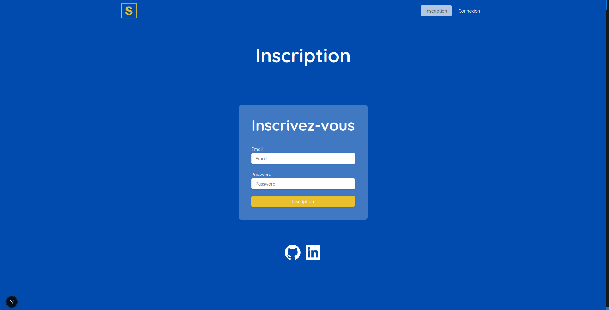
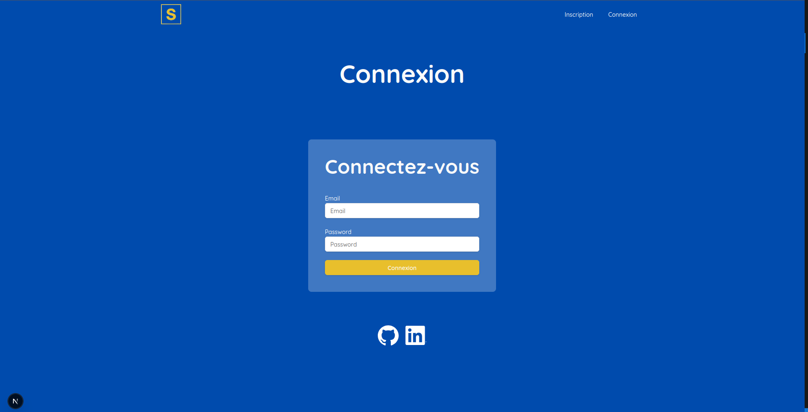
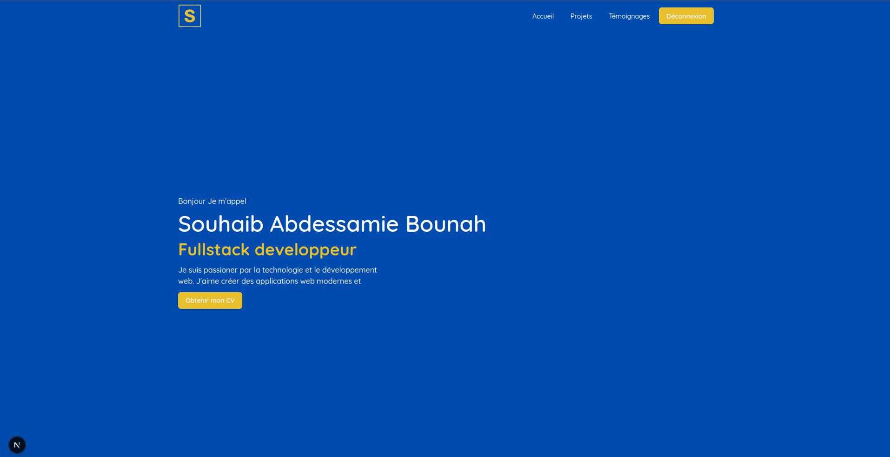
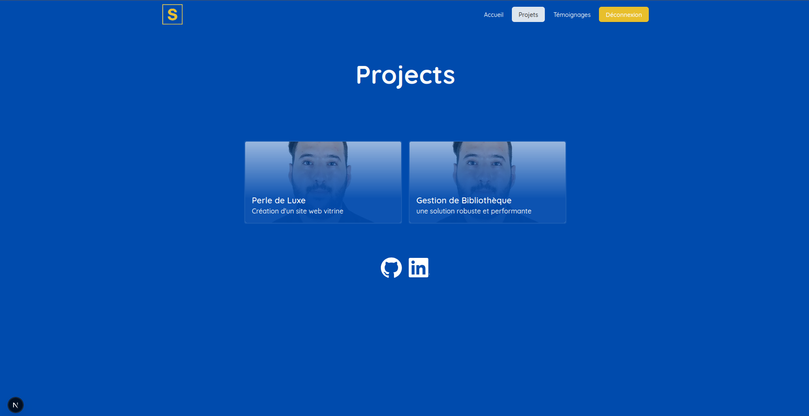
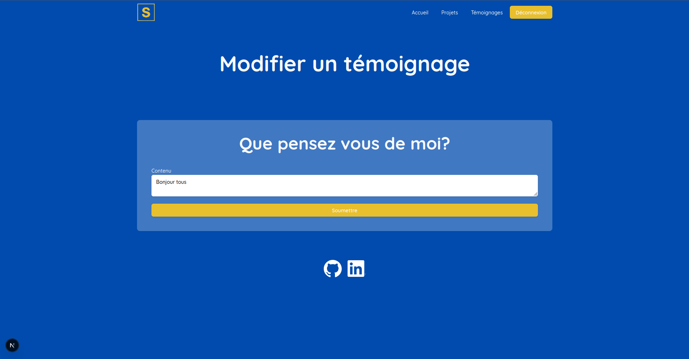

# Projet portfolio
## Installation
```bash
npm i
```
## Lancer l'application
Lancer le serveur:

```bash
npm run dev
```

## Instructions pour commencer

1. **Inscription** : Rendez-vous sur la page d'inscription et créez un compte.

2. **Connexion** : Une fois inscrit, accédez à la page de connexion pour vous connecter.

3. **Navigation** :
    - Après connexion, vous serez redirigé vers la page d'accueil.
    

    - vous pourrez consulter la liste des projets.
    
    - vous pourrez consulter les détails d'un projet.
    
    - vous pourrez consulter les témoignages(qui seront vide au début).
    
    - vous pouvez ajouter  un temoignage.
    
    - vous pouvez modifier un temoignage que vous avez vous même éffectuer.
    
    

## Gestion de l'état avec Redux-Persist

Dans ce projet, nous utilisons `redux-persist` pour gérer la persistance de l'état global de l'application. `redux-persist` est une bibliothèque qui permet de sauvegarder automatiquement l'état de Redux dans un stockage persistant, comme le localStorage ou le sessionStorage, afin que les données soient conservées même après un rechargement de la page ou une fermeture du navigateur.

### Cas d'utilisation dans ce projet :
- **Utilisateurs** : Les informations des utilisateurs connectés sont sauvegardées pour éviter de demander une nouvelle authentification à chaque rechargement de la page.
- **Authentification** : Les jetons d'authentification (tokens) sont persistés pour maintenir la session active.
- **Témoignages** : Les données des témoignages sont également stockées pour améliorer les performances et réduire les appels réseau inutiles.

Grâce à `redux-persist`, l'expérience utilisateur est plus fluide et les données importantes restent disponibles même en cas de rafraîchissement de l'application.


